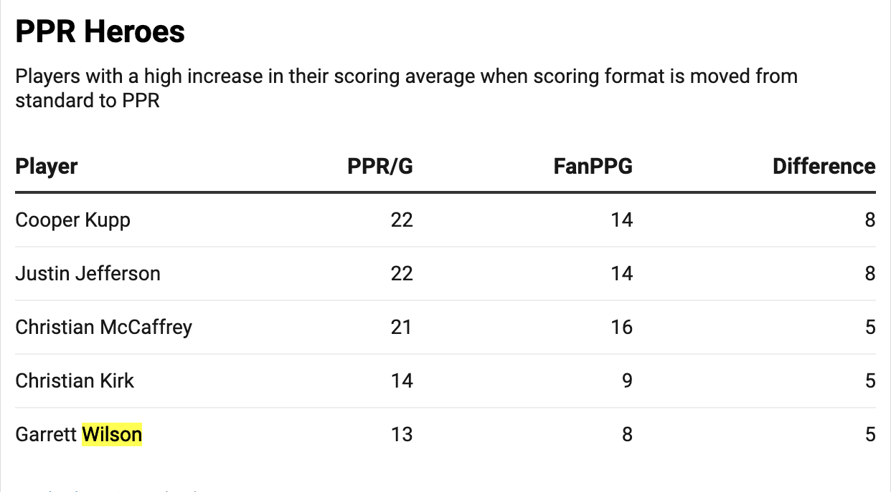

# Players to keep an eye on in Fantasy Football 2023
## Story Summary
2022 was an alectric year for fantasy football- if you were a winner. Regardless of whether you won or lost, it's time to get ready for another competitive season. Analyzing data from Stathead Football (Pro Football Reference's main database), I identified several players who could make an impact in on the field, while simeultaneously making an impact on your fantasy team. Most people who play fantasy football know the difference between standard and PPR format (points per reception) leagues, but the media tends to only write articles ranking the best NFL players based on standard-format scoring. Due to this, people aren't aware of those NFL players who have a big change in their value depending on which scoring format is being used.

## Sourcing
[Stathead Football](/sportsref_dowload.xls)

Stathead Football is the main databased for sports statistics used by many sports agencies, so I got my data from here. I filtered my search to only have stats from 2022, and to show the main fantasy football positions, QB (quarterback), RB (running back), WR (wide receiver), and TE (tight end). The dataset I downloaded from Stathead Football looked at stats from the top 100 fantasy scoring NFL players during the 2022 season. This dataset had all 100 players ranked 1-100 based on how many fantasy points they had total the prior season. It's important to note that this ranking was based on a standard-format league, rather than a PPR (points per reception) format league. 

## Potential Interview Contacts:

1. Benjamin Klein -
   * (925)-550-3830
   * benklein2006@yahoo.com
   * Ben has been a longtime fantasy football guru, and a good friend. He has managed over 50 teams over the past decade and has a strong knowledge of fantasy football statistics. I would want to ask him questions about what players he has his eye on this year, and how he made those conclusions. I also want to know what he thinks of the players my study found to be gems.

2. Michael Lanning -
   * 925-786-7819
   * lannim1@unlv.nevada.edu
   * Mike is an oustanding fantasy football league commissioner who comes up with his own player rankings going into every season. He's also a goof friend of mine who appreciates data analysis of sports statistics. I would like to learn how he comes up with his own rankings, as well as ask him if he also finds players whose fantasy performance is dramatically impacted by the type of league scoring format.

## Additional sources
[CBS Fantasy Football Advanced Stats Guide](/CBS_Fantasy1)
* Sifting through professional guides are a great way to get a better understanding of fantasy football statistics. After reading through this report, I was ale to draw inspiration for the questions I pose in this analysis.
  
[Fantasy Pros Perfect 2023 Fantasy Football Draft Strategy, Advice & Targets](/Fantasy_Pros.1)
* I read this report from Fantasy Pros, which I've been following for nearly a decade. This report was released recently and helped me understand what to look for in the data I downloaded.

# Data Visualization and Analysis

* Just to set the scene, here is a list of those top standard-format scoring fantasy football NFL players from the previous season that most fantasy footballers see. But there are many more names worth noting.

## Question 1
#### Who are the 5 most players in PPR format fantasy football heading into 2023?
* To answer this question, I had to create a pivot table to look at each player's scoring in PPR-formats rather than standard-format. Then, I took into account players who maybe didn't play every game by filtering by PPG (points per game).

*  then removed those players that scored <200 points since anything less than 200 would imply they only played a handful of games. I did this to remove any "one hit wonders" that might've occured.

#### [Top 5 PPR players](https://datawrapper.dwcdn.net/HqpUY/1/)
* I was then able to identify the top 2022 PPR NFL players as the 5 at the top of the list

## Question 2

#### Which NFL players had their ranking dramatically improved when scoring format was moved to PPR?
* To answer this question, I created a pivot table to look at each player's scoring in PPR-formats. I also removed any player who scored less than 200 points to remove anyone who maybe just had one good game. These steps were identical to the last problem so far.

* From here, I removed anyone whose previous standard-format rank was between 1-10 as these players are already ranked high. I then made a new pivot table with the remaining data.

#### [The NFL players who had their ranking dramatically improved when scoring format was moved to PPR](https://datawrapper.dwcdn.net/0aJiY/1/)
 

## Question 3
#### Which Players were held back by injury last year in PPR-format?
* It's never a bad idea to identify who was on a roll last year despite suffering injuries. Players who miss games end up scoring less points than they should've, and they got lost in the data when season totals are being discussed. Keeping an eye on pleyrs like that can be pivotal.

* I made a pivot table with the NFL players in the rows and their PPR-format-PPG in the values. 

#### [The NFL Players that were held back by injury last year](https://datawrapper.dwcdn.net/0BZdu/1/)
* I then added a filter to remove anyone who scored over 200 points and looked at the remaining players who led in PPG.

## Question 4:
#### Which players have a high increase in their scoring average when scoring format is moved from standard to PPR?
* Depending on your position, the difference between standard and PPR formats can lead to dramatic changes in total points. I wanted to find out which players rely heavily on PPR-format, as PPR leads to higher scoring totals for most positions.
* First, I created a pivot table of NFL players and their respective points per game for both standard and PPR formats.

* Then, I created a formula to determine the difference between the two columns of 'points per game'. This would tell me which players have increases in their points per game when they are scored in PPR-format.

#### [5 player's who's totals increase the most when scoring format is changed from standard to PPR](https://datawrapper.dwcdn.net/Qaz56/1/)
* After putting the list in order from the biggest difference to the smallest, I was able to detirmine which players score more points when the scoring format is PPR.

## Question 5
#### What position has has more value in PPR-format fantasy leagues? (i.e. what position benefits the most from PPR)
* We've already identified individual studs who's fantasy performance improves when scoring format is changed from standard to PPR, but which overall position group benefits the most? It's important to know what kind players to target in fantasy drafts.
* First, I made a pivot table of NFL positions and their season point totals for both standard and PPR formats.

* Then I added a formula that I applied to all the rows. This formula caluclated the difference between the two point totals for every player in the database.

[The Position with the most value when in PPR-format leagues is WR (Wide Reciever)]()

